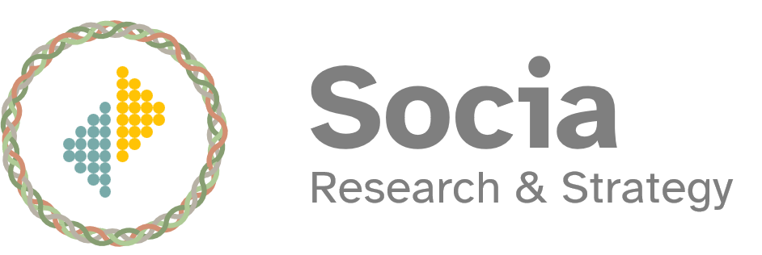

<!-- Hero / Introduction -->







I am excited to be offering research and strategy services under the brand of Socia!




Through Socia, my mission is to strengthen community well-being by making innovative scientific and managerial practices accessible and useful for all.  

  My expertise is market and organizational research. With my skills in quantitative and qualitative research methods, I collaborate with partners to create useful tools and actionable strategies.  

<!-- Main CTAs -->

  <a href="mailto:dallasnovakowski@gmail.com" class="cta-button contact">Schedule Your Free Consultation</a>




  <a href="/community-market-research-consulting/example-products/" class="cta-button examples">View Example Products</a>





  <a href="/community-market-research-consulting/resource-library/"  class="cta-button library">Access My Resource Library</a>




<!-- How Socia Works -->
# How Socia Works

I believe that **the data analytics and insights industry is poised for disruption**—similar to the shift toward *Open Science* in academic research, where [scientific data, materials, and processes are made freely available to all](https://science.gc.ca/site/science/en/open-science). By making data and analysis procedures publicly available, scientists accelerate innovation and build knowledge that is both more robust and transparent. 

I embrace these principles to ensure high-quality tools, processes, data, and insights are shared widely and responsibly, empowering organizations to make informed decisions with greater confidence and independence.

<!-- Image Row -->

  

    
    
  

<!-- Needs -->
## The Needs My Work Addresses

Through my work with diverse organizations, I've identified several key challenges that teams commonly face. Here’s how my work through Socia addresses them:



###  <a style="color: #D39600"> Bottom Lines & Deadlines  </a>
We help you balance budgets and timelines while delivering high-quality insights through careful planning and thoughtful trade-offs.



###  <a style="color: #C55A11"> Usefulness  </a>
Our findings are designed to be actionable and comparable, ensuring that knowledge informs real decisions and generates meaningful impact.





###  <a style="color: #714096"> Ethics & Privacy    </a>
We navigate complex ethical considerations, safeguarding privacy and incorporating principles of Reconciliation, Equity, Diversity, and Inclusion.



###  <a style="color: #638F8E"> Scalability  </a>
We build systems that support scalable and reproducible evidence-based practices, ensuring consistency across projects and contexts.





###  <a style="color: #D39600"> Trust  </a>
We foster meaningful and considerate collaboration with internal and external rights-holders, building trust within teams and across partnerships.



###  <a style="color: #C55A11"> Adaptability  </a>
We help you stay agile, adapting plans and tactics as needed to meet changing project requirements.



## The Possibilities

Imagine a future where the best practices of Open Science are seamlessly integrated into the insights and analytics profession. How can we deploy these practices to meet the unique needs of organizations and exceed industry standards? I invite you to join me in finding innovative solutions to this exciting challenge.

  <a href="mailto:dallasnovakowski@gmail.com" class="cta-button contact">Schedule Your Free Consultation</a>

  <a href="/community-market-research-consulting/about-brand/"  class="cta-button about">Learn More About the Brand</a>

