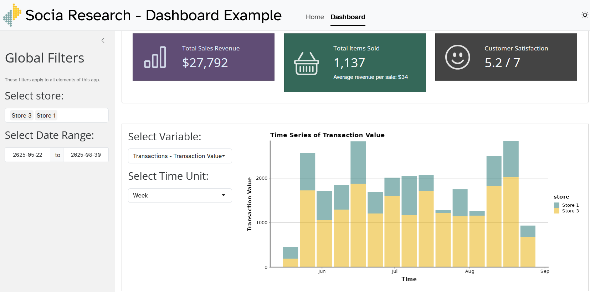
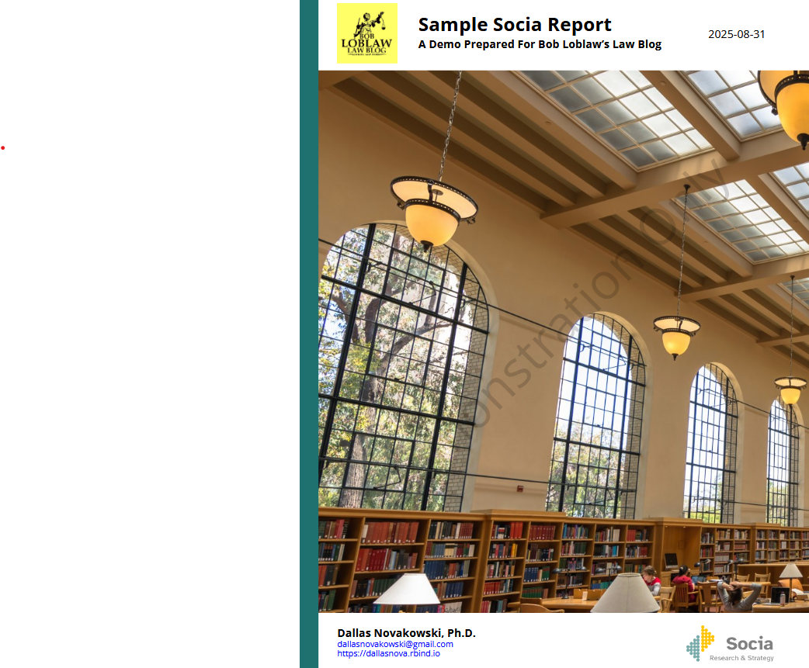

  <h1>Example Products</h1>
  

This page offers some demos of what some of my work looks like. Please note that these products do not contain real data, instead being simulated for the purposes of demonstration. The materials here can be accessed via my [github site](https://github.com/DallasNovakowski/socia_demo)

### My Preferred Tech and Tools

My primary tools and software used revolves around the the programming language R, and its related applications and packages, such as Rstudio (for user interface), ggplot (for data visualization) Shiny (for dashboarding), and Quarto (for generating reports). This system has the particular benefit of being open source, meaning that the software is free to use and edit, so that advanced methods are constantly being added. However, I am also proficient in other software and tools as needed (e.g. Tableau, PowerBI, Python, Excel, SQL, PowerQuery).

## Methods for Visualizing and Reporting Data

  

  <!-- Button + description -->
  

    <a href="https://gzlvni-dallas-novakowski.shinyapps.io/socia_demo/" class="cta-button library">Click to view Demo Dashboard</a>
    

      Dashboards have become popular for good reason; they give users agency to customize the analyses available, selecting particular target measures, while grouping and filtering to address their particular needs. 
         
  Working in close collaboration with your team, we will make a dashboard to suit your unique needs.
    

  

  <!-- Image -->
  

  

  

  <!-- Button + description -->
  

    <a href="/uploads/socia_report_demo.pdf" class="cta-button examples">Click to View Static Reports</a>
    

      Research and data analysis is about more than just showing data - it's about telling a story. Often, teams need a curated report to show them exactly what is going on, and what it means for you.     I work hard to learn your exact organizational context and priorities, and create digestible reports that do the heavy lifting of selecting relevant groups and filters, to show you exactly what you need to know, and how it can be used. 

  

  

  <!-- Image -->
  

  











